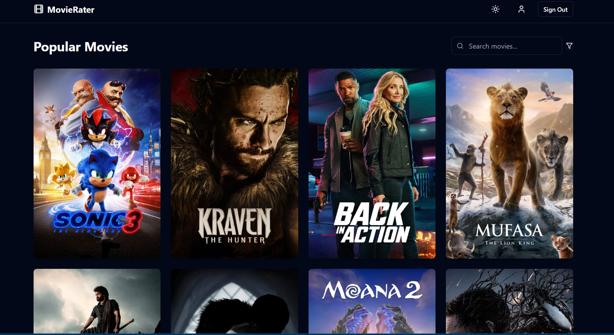

# Movie Rating and Recommendation Website




This project is a  rating and recommendation website. It fetches movie ratings from various sources, computes average ratings, and provides personalized movie recommendations based on the user's mood. The website also features an intuitive UI with animations, a theme switcher, and an intimacy rating feature.

## Features

- **Movie Rating**: Fetch and display ratings from multiple websites.
- **Recommendations**: Suggest movies based on user mood.
- **Intimacy Rating**: Classify movies based on intimacy levels (`Little`, `Some`, `Very Much`, `Most`).
- **Theme Switcher**: Toggle between light and dark modes.
- **Responsive UI**: Beautiful animations and responsive design for all devices.
- **Genre Filtering**: Filter movies by genre.
- **Search Functionality**: Search for movies by name.

## Tech Stack

### Frontend
- **React**: Component-based UI development.
- **Tailwind CSS**: Styling with utility-first CSS framework.
- **React Router**: For navigation and routing.

### Backend
- **TMDB API**: For fetching movie data and details.

## Prerequisites

- **Node.js** (v14 or higher)

- **TMDB API Key**

## Installation

1. Clone the repository:
   ```bash
   git clone https://github.com/vaibhavisno-one/Movie-Rating
   cd Movie_rating
   ```

2. Install dependencies:
   ```bash
   npm install
   ```


4. Start the development server:
   ```bash
   npm run dev
   ```

5. Open the application:
   Visit `http://localhost:5173` in your browser.


## Usage

1. **Search for Movies**: Use the search bar to find specific movies.
2. **Filter by Genre**: Select a genre to view movies within that category.
3. **View Details**: Click on a movie to view its details, ratings, and recommendations.
4. **Rate a Movie**: Log in to rate a movie and add reviews.
5. **Switch Themes**: Use the theme switcher to toggle between light and dark modes.

## API Integration

### TMDB API
- Fetch movie data, genres, and recommendations.


## Contributing

1. Fork the repository.
2. Create a new branch:
   ```bash
   git checkout -b feature-name
   ```
3. Commit your changes:
   ```bash
   git commit -m "Add some feature"
   ```
4. Push to the branch:
   ```bash
   git push origin feature-name
   ```
5. Open a pull request.

## License

This project is licensed under the [MIT License](LICENSE).

---

Enjoy exploring and rating movies! 🎥🍿
